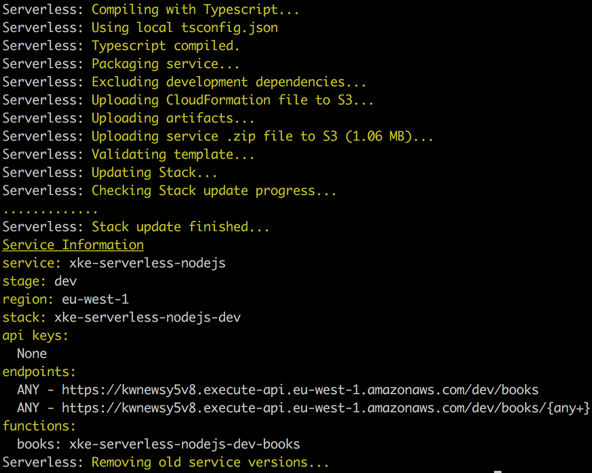

Vous reprennez la maintenance d'un projet Express qui était packagé en Docker.
Votre responsabilité est de le faire fonctionner avec AWS Lambda


## Lancer l'application
Faire tourner en local l'application
```
npm start

curl http://localhost:3000/books
```

Ou via docker

```
docker build -t xke-serverless .
docker run -ti --rm -p 3000:3000 xke-serverless

curl http://localhost:3000/books
```


# Migration AWS Lambda

## Transformer les requêtes API Gateway en HTTP
L'intégration API Gateway et Lambda sera configurée en *LAMBDA_PROXY*. De ce fait le handler de la lambda recevra [une requête
API Gateway](https://docs.aws.amazon.com/apigateway/latest/developerguide/set-up-lambda-proxy-integrations.html#api-gateway-simple-proxy-for-lambda-input-format) et renvera [une réponse compatible API Gateway](https://docs.aws.amazon.com/apigateway/latest/developerguide/set-up-lambda-proxy-integrations.html#api-gateway-simple-proxy-for-lambda-output-format)


[La librairie serverless-http](https://www.npmjs.com/package/serverless-http) fait ce travail pour nous.

```
npm install -S serverless-http
```

Créer un fichier *BookHandler.ts* dans le répertoire *handlers* et y mettre le contenu suivant :
```typescrypt
import { APIGatewayEvent, Context as LambdaContext, ProxyCallback } from 'aws-lambda';
import * as serverlessHttp from 'serverless-http';
import app from '../index';

export async function handler(event: APIGatewayEvent, context: LambdaContext, callback: ProxyCallback) {
  await serverlessHttp(app)(event, context, callback);
}
```

## serverless.yml

### Créer le fichier serverless.yml à la racine du projet
```yml
service: xke-{TRIGRAMME}

provider:
  name: aws
  runtime: nodejs6.10
  region: eu-west-1
  endpointType: regional

plugins:
# TODO
  
custom:
  stage: ${opt:stage, self:provider.stage, env:USER}

functions:

  books:
    handler: app/handlers/BookHandler.handler
    name: xke-serverless-books-${self:custom.stage}
    memory: 128
    timeout: 10
    events:
      # TODO
```


### Plugins
Pour avoir une transpilation TypeScript intégré au cycle de vie du framework serverless il faut installer [le plugin serverless-plugin-typescript](https://www.npmjs.com/package/serverless-plugin-typescript)

Pour simuler l'API Gateway sur son poste [le plugin serverless-offline](https://www.npmjs.com/package/serverless-offline) est parfait

### Events http
Le routage s'effectue au sein de la lambda via Express, il est donc pas obligatoire de déclarer toutes les routes dans l'API Gateway. 

Il existe plusieurs écoles avec chacune ses avantages et inconvénients. À vous de choisir la vôtre :
 - déployer une lambda par endpoint HTTP
 - déployer une lambda par ressource REST
 - déployer une lambda pour toute l'applicaiton
 
 
```
events:
      - http:
          path: /books
          method: ANY
      - http:
          path: /books/{any+}
          method: ANY
```
 
 
## Premier déploiement
### Local
```
serverless offline

curl http://localhost:3000/books
```
### AWS

Avant de déployer sur AWS assurez vous de ne pas être en conflit avec les autres participants. Pour se faire nous allons utiliser 
la notion de stage du framework serverless. Utile pour différencier les environnements *--stage dev*, *--stage prod*, nous mettrons notre trigramme
ex: *--stage jpi*


```
serverless deploy --stage {TRIGRAMME}dev

curl http://ENDPOINT_API_GATEWAY/{TRIGRAMME}dev/books
```
Résultat attendu



# Conclusion
A ce stade vous êtes capable de déployer votre code dans un container docker ainsi que dans une lambda. 

# Allons plus loin
## Variables
À l'origine, la notion de stage sert à gérer les environnements. Le framework serverless permet de gérer [différentes sources de variables](https://serverless.com/framework/docs/providers/aws/guide/variables/)

Voyons comment lister les variables par environnement dans un fichier de configuration. Disons que la mémoire allouée à la lambda dépend de l'environnement :


**Fichier serverless-config.yml**
```
jpi_dev:
  memory: 128

jpi_prod:
  memory: 512
```

**Fichier serverless.yml
```
custom:
  # load key corresponding to the stage in the file or if key doesn't exist load "jpidev"
  perEnv: ${file(serverless-config.yml):${self:custom.stage}, file(serverless-config.yml):jpidev}
  
...

memorySize: ${self:custom.perEnv.memory}
```

## Tracing

** Activer xray**


# Migration DynamoDB

## Création de la table
La liste des livres est un mock stocké dans le code. Nous allons utiliser la base de données DynamoDB.

Il est possible d'ajouter des [ressources CloudFormation](https://serverless.com/framework/docs/providers/aws/guide/resources/) dans le fichier serverless.yml
```
resources:
  Resources:
    BookTable:
      Type: 'AWS::DynamoDB::Table'
      DeletionPolicy: Delete
      Properties:
        AttributeDefinitions:
          - AttributeName: 'id'
            AttributeType: 'S'
        KeySchema:
          - AttributeName: 'id'
            KeyType: 'HASH'
        ProvisionedThroughput:
          ReadCapacityUnits: 1
          WriteCapacityUnits: 1
        TableName: ${self:custom.stage}-book
```

## Utilisation de la table
### Ajouter le SDK AWS dans le code

```
npm install -S aws-sdk
```

**Fichier utils/awssdk.ts**
```typescript
import { APIVersions, ConfigurationOptions } from 'aws-sdk/lib/config';
import * as AWS from "aws-sdk";


const awsconf: ConfigurationOptions & APIVersions = {
  region: "eu-west-1",
  apiVersions: {
    apigateway: '2015-07-09',
    cloudwatch: '2010-08-01',
    dynamodb: '2012-08-10',
    lambda: '2015-03-31',
    s3: '2006-03-01'
  }
};
AWS.config.update(awsconf);

const DynamoDB = new AWS.DynamoDB();
const DocumentClient = new AWS.DynamoDB.DocumentClient();

export { DynamoDB };
export { DocumentClient };
export default AWS;
```

### Ajouter la variable d'environnement
L'application est déjà paramétrée pour utiliser la variable d'environnement TABLE_BOOK (config.js)

```
functions:

  books:
  
    environment:
      TABLE_BOOK: ${self:custom.stage}-book
```


### Coder le répository
```typescript
import { DocumentClient as Dynamo} from '../utils/awssdk'
import config from '../utils/config'
import logger, { errorToString } from '../utils/logger.utils';
import { Book } from '../../typings/Book';
import { DocumentClient } from 'aws-sdk/lib/dynamodb/document_client';


export async function get(bookId: string): Promise<Book> {
  try {
    const result: DocumentClient.GetItemOutput = await Dynamo.get({
      TableName: config.dynamodb.book,
      Key: { id: bookId }
    }).promise();

    return <Book> result.Item;

  } catch (error) {
    logger.error(`BookRepository.get - Error reading book ${bookId}`, { error: errorToString(error) });
    throw error;
  }
}

export async function list(): Promise<Book[]> {
  try {
    const result = await Dynamo.scan({
      TableName: config.dynamodb.book
    }).promise();

    return <Book[]> result.Items;
  } catch (error) {
    logger.error(`BookRepository.get - Error listing books`, { error: errorToString(error) });
    throw error;
  }
}
```

### Brancher le répository dans le controller


### Ajouter les droits à la lambda

**Fichier serverless.yml**
```
provider:
  iamRoleStatements:
    - Effect: Allow
      Action:
        - dynamodb:*
      Resource:
        - "Fn::Sub": "arn:aws:dynamodb:${self:custom.region}:*:table/${self:custom.stage}-book*"
```

### Déployer

```
serverless offline
curl http://localhost:3000/books

serverless deploy --stage {TRIGRAMME}dev

curl http://ENDPOINT_API_GATEWAY/{TRIGRAMME}dev/books
```

# Tests d'intégration
Le but va être de réutiliser les tests d'intégration déjà codés pour la partie Docker. 
Ces tests attaquent la couche HTTP avec *supertest* et vont jusqu'à la base de donnée.

## Installer DynamoDB local
```
npm run dynamodblocal:install
```

## Configurer les SDK AWS pour pointer sur la base locale

**Fichier utils/awssdk.ts**
Remplacer
```javascript
const DynamoDB = new AWS.DynamoDB();
const DocumentClient = new AWS.DynamoDB.DocumentClient();
```
par
```javascript
let DocumentClient, DynamoDB;
if (process.env.NODE_ENV === 'test') {
  const configDynamo = {
    region: "eu-west-1",
    endpoint: "http://localhost:8888",
    accessKeyId: 'dummy',
    secretAccessKey: 'dummy'
  };

  DynamoDB = new AWS.DynamoDB(configDynamo);
  DocumentClient = new AWS.DynamoDB.DocumentClient(configDynamo);
}
else {
  DynamoDB = new AWS.DynamoDB();
  DocumentClient = new AWS.DynamoDB.DocumentClient();
}
```

## Alimentation des tables
**Fichier tests/books.test.js**
```javascript
// Importer les functions du fichier tests.utils.js
import { afterAllHook, beforeAllHook, afterEachHook, populateDatabase } from './tests.utils'

// [...]

// Dans le describe brancher les hooks
beforeAll(beforeAllHook, 10000);
afterAll(afterAllHook);
afterEach(afterEachHook);

// [...]

// Au début du tests ajouter cette ligne
await populateDatabase('./data/books-01.json');

//
```

## Création des tables
Les tables sont créées à l'aide du SDK AWS avec une description JSON.

**Fichier tests/tables/books.table.json**
```json
{
  "TableName": "books",
  "AttributeDefinitions": [
    {
      "AttributeName": "id",
      "AttributeType": "S"
    }
  ],
  "KeySchema": [{
      "AttributeName": "id",
      "KeyType": "HASH"
    }
  ],
  "ProvisionedThroughput": {
    "ReadCapacityUnits": 1,
    "WriteCapacityUnits": 1
  }
}
```
/!\ Cela fait une double définition entre le fichier serverless.yml et les tests. Vos idées sont les bienvenues :)

## Lancer les tests
```
npm test
```
